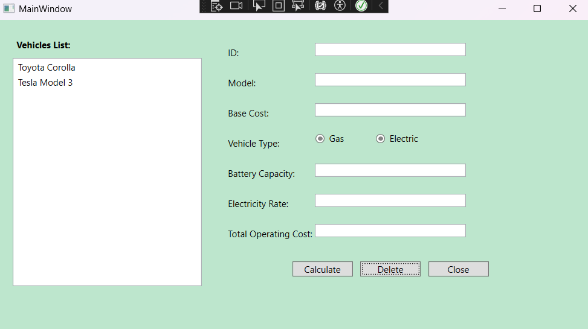
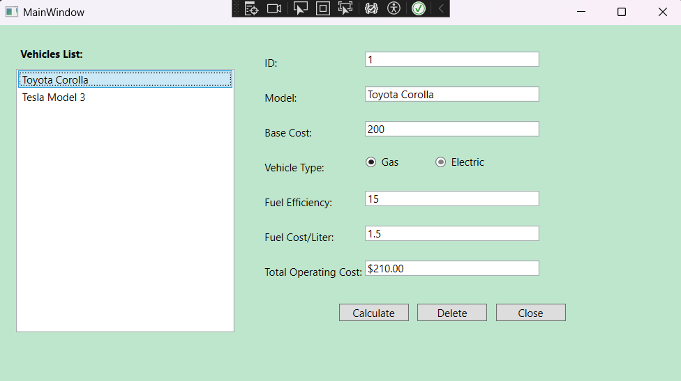
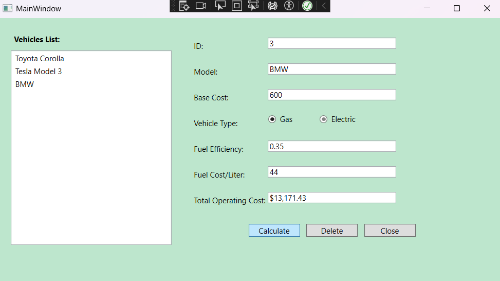
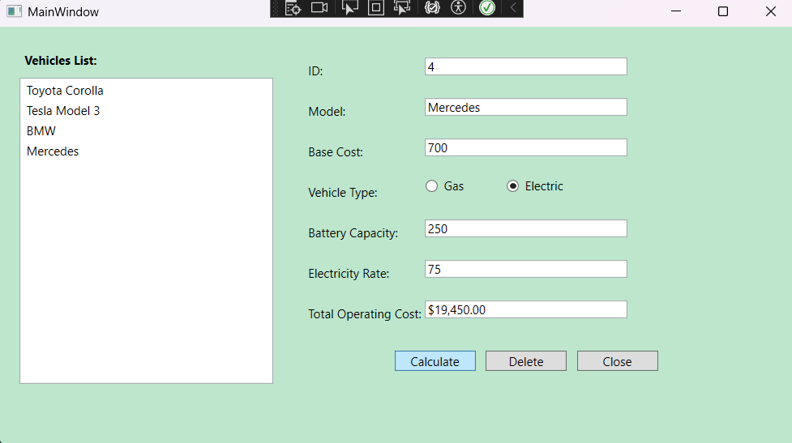
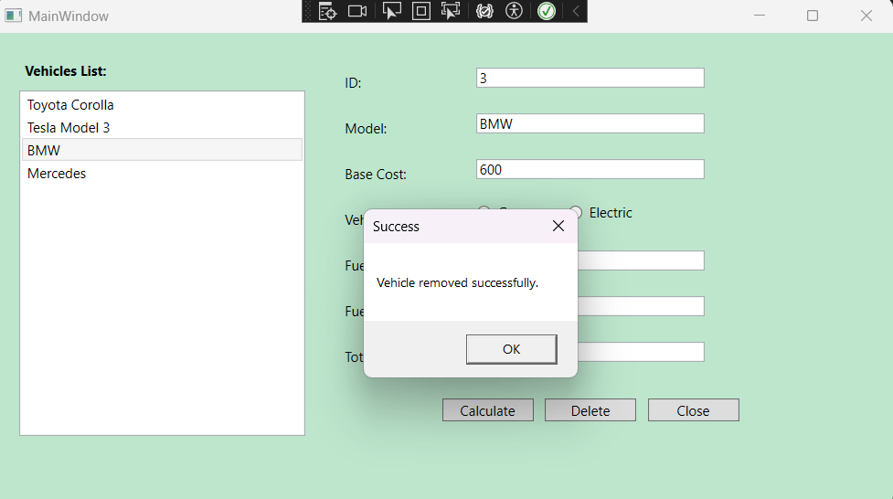

# AutoTrack - Vehicle Management Application

AutoTrack is a C# WPF desktop application designed to manage different types of vehicles while demonstrating core Object-Oriented Programming (OOP) principles. The application supports different vehicle categories, including gas-powered and electric vehicles, through a structured inheritance-based design.

The project focuses on applying software design concepts such as inheritance, encapsulation, polymorphism, and class organization while building a user-friendly Windows desktop application using Windows Presentation Foundation (WPF).

---

## Overview

This project was developed as a desktop vehicle management application using **C# and WPF (.NET)**.

The application allows users to work with different vehicle types while maintaining a clean object-oriented structure. A base vehicle class is extended by specialized vehicle classes to represent different behaviors and properties.

The project demonstrates how object-oriented programming concepts can be applied to build maintainable and scalable applications.

---

## Features

- Create and manage different vehicle types
- Support for gas-powered vehicles
- Support for electric vehicles
- Display vehicle information through a graphical user interface
- Object-oriented class design using inheritance
- Different vehicle behaviors through polymorphism
- WPF-based desktop user interface

---

## Technologies Used

- C#
- .NET
- Windows Presentation Foundation (WPF)
- XAML
- Object-Oriented Programming (OOP)
- Visual Studio

---

## Object-Oriented Design

The application follows an inheritance-based design where a base vehicle class provides common properties and behaviors, while specialized vehicle classes extend the functionality.

```
              Vehicle
                 |
        -------------------
        |                 |
   GasVehicle      ElectricVehicle
```

### OOP Concepts Demonstrated

### Inheritance

`GasVehicle` and `ElectricVehicle` inherit common functionality from the `Vehicle` base class.

### Encapsulation

Vehicle properties and behaviors are organized within classes to maintain clean data management.

### Polymorphism

Different vehicle types can implement their own behavior while sharing a common structure.

### Abstraction

Common vehicle characteristics are separated from specific vehicle implementations.

---

## Project Structure

```
AutoTrack/
│
├── AutoTrack.sln
│
├── AutoTrack/
│   ├── App.xaml
│   ├── App.xaml.cs
│   ├── MainWindow.xaml
│   ├── MainWindow.xaml.cs
│   │
│   ├── Vehicle.cs
│   ├── GasVehicle.cs
│   ├── ElectricVehicle.cs
│   │
│   ├── AutoTrack.csproj
│   └── AssemblyInfo.cs
│
├── images/
│
└── README.md
```

---

## Application Screenshots

### Main Application Window



### Exsiting Vehicles



### Gas Vehicle



### Electric Vehicle



### Deleting a Vehicle



---

## Installation and Setup

### Prerequisites

- Visual Studio 2022
- .NET SDK
- Windows operating system

---

### Steps

1. Clone the repository

```bash
git clone https://github.com/YOUR-USERNAME/AutoTrack.git
```

2. Open the solution file

```
AutoTrack.sln
```

using Visual Studio.

3. Restore required dependencies.

4. Build and run the application.

---

## Future Improvements

- Add database integration for persistent vehicle storage
- Implement CRUD operations for vehicle records
- Add user authentication
- Add search and filtering functionality
- Improve UI design using modern WPF styling
- Add reporting and analytics features
- Convert backend logic into a service-based architecture

---

## Learning Outcomes

Through this project, I gained practical experience with:

- Developing desktop applications using WPF
- Designing applications using object-oriented principles
- Creating reusable classes through inheritance
- Managing UI interactions using XAML
- Structuring C# projects using clean organization practices

---

## Author

Dhruvi Jariwala

GitHub:
[GITHUB-LINK](https://github.com/dhruvi-mnv/)

LinkedIn:
[LINKEDIN-LINK](https://www.linkedin.com/in/dhruvi-jariwala-53b9a828b/)
